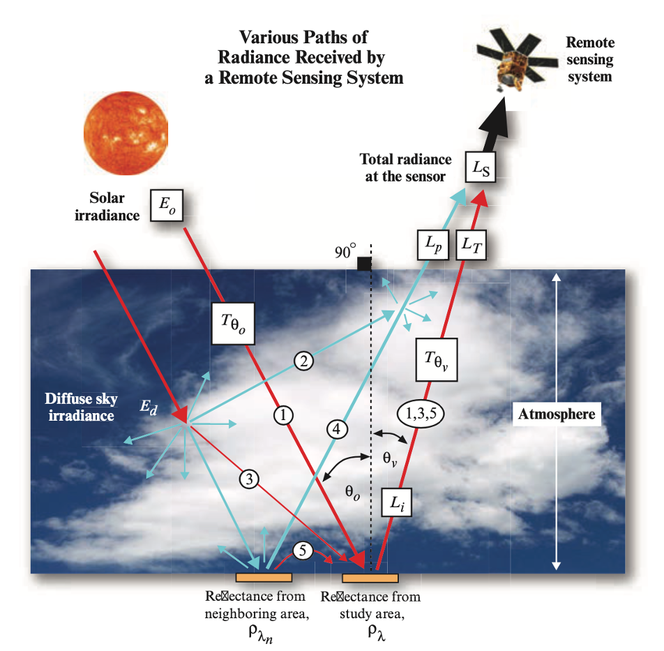

# Who are we

## Your lecturer {.smaller}

### [Ivan Lizarazo](https://cienciasagrarias.bogota.unal.edu.co/facultad/profesores/ivan-alberto-lizarazo-salcedo)

## Students {.smaller}

### Please introduce yourselves

# NASA EO satellites

Earth Observing Fleet (January 2023)

<!-- blank line -->
<figure class="video_container">
  <video controls="true" allowfullscreen="true" poster="path/to/poster_image.png">
    <source src="https://svs.gsfc.nasa.gov/vis/a000000/a005000/a005061/fleet_2023_jan_1080p60.mp4" type="video/mp4">
  </video>
</figure>
<!-- blank line -->

# ESA Copernicus Sentinel satellites

[Current Sentinel satellites](https://www.dlr.de/en/eoc/research-transfer/topics/copernicus-the-european-earth-observation-programme/the-copernicus-sentinel-satellites)

# What we know about remote sensing 

Open your notebook and write down if you agree or not with each of the next statements

## Statement 1
Multispectral satellite sensors measure the reflectance of features on the ground

## Statement 2
Land cover classification is a simple process of grouping  pixels based on spectral properties 

## Statement 3
Spectral resolution is the number of bands  available from a particular sensor 

## Statement 4
Landsat TOA imagery allows users to consistently classify natural vegetation genus and species information with a high level of accuracy

## Statement 5
Square pixels in an image accurately represent a square area on the Earth's surface

## Atmospheric correction

# What we know about Python

## Basic python quiz 

### [Solve this simple quiz](https://pynative.com/basic-python-quiz-for-beginners/)

# Flipped classroom

## Reading, doing and writing

A flipped classroom is structured around the idea that lecture or direct instruction is not the best use of class time. Instead students encounter information before class, freeing class time for activities that involve higher order thinking

# Thermal remote sensing

[Thermal remote sensing](https://drive.google.com/file/d/1pgKW7OllThNxFW-zunaLi5sCmVedaJ_e/view?usp=sharing)

# To do before next class 

## Refreshing GEE skills

Do any of these tasks:

- [GEE JavaScript tutorial](https://ials.github.io/GEE-RIO/)

- [GEE Python tutorial](https://ials.github.io/GEE_Python/2_eeImage.html)

## Suggested topics for research

- [Satellite Remote Sensing of Global Land Surface Temperature](https://agupubs.onlinelibrary.wiley.com/doi/10.1029/2022RG000777)

- [Thermal remote sensing for plant ecology](https://besjournals.onlinelibrary.wiley.com/doi/epdf/10.1111/1365-2745.13957)

- [Atmospheric correction for the monitoring of land surfaces (Vermote & Kotchenova)](https://agupubs.onlinelibrary.wiley.com/doi/full/10.1029/2007JD009662)

## [Back to this week page](page.qmd)

