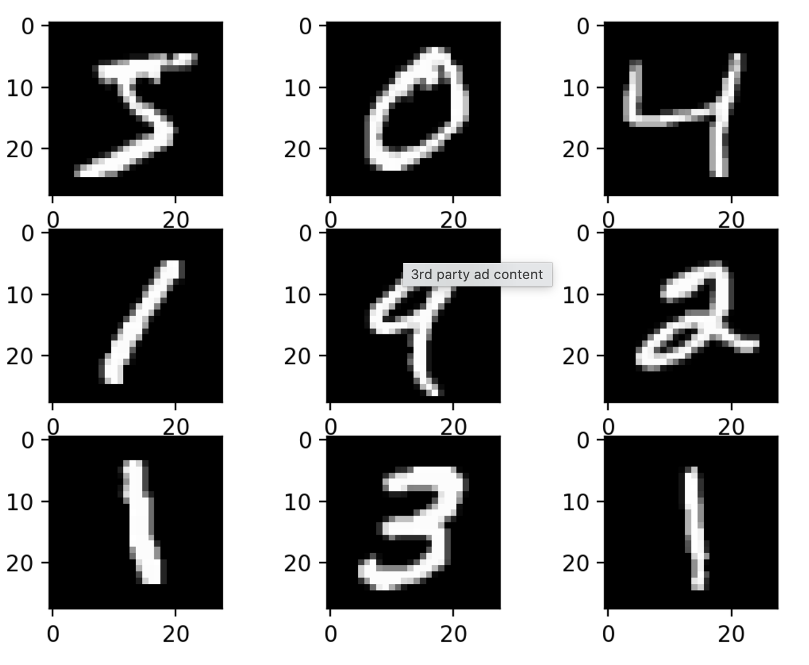
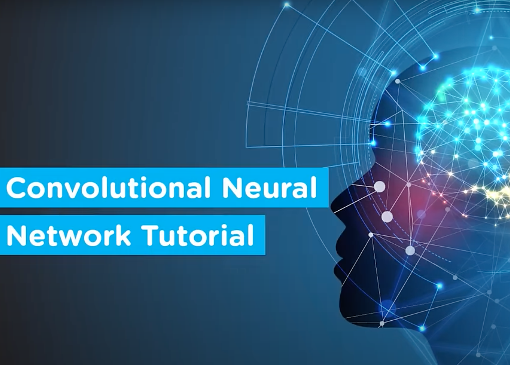

In this  week, we will get to know [what are convolutional neural networks](https://drive.google.com/file/d/1hPY6L8Z-cRCqveZbLdr0TQZo_SSsamvU/view?usp=sharing)

## 👨‍ Classroom Practical Task 

Reproduce a convolutional neural network to classify MNIST digits. 

You can download the *Chapter 3's Jupyter notebook* and the *idlman.py script* [from here](https://github.com/EdwardRaff/Inside-Deep-Learning). 

## Assignment

Make sure you complete the practical task within this week. In your physical notebook, summarize what have you learned from it.

## References

- Read [*Inside Deep Learning's Chapter 3*](https://drive.google.com/file/d/1UngESG-Hw7S86IwhYre23hVMSaCN27hA/view)

- Watch  [CNN in Deep Learning](https://www.simplilearn.com/tutorials/deep-learning-tutorial/convolutional-neural-network)

