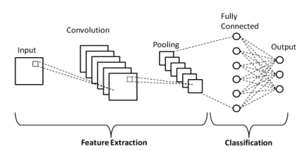
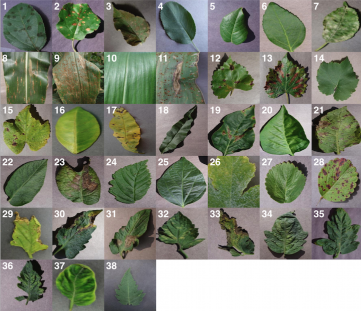

In this  week, we will learn  a Convolutional Neural Network for semantic segmentation of aerial images.

## 👨‍🏫 Theory

[Slides](https://drive.google.com/file/d/1kT6TdVa_xtoqKUjdqE3L4yEy020mudZ4/view?usp=sharing)

## 👨‍🏫 Practical

Build a CNN  using PyTorch to classify plant leaf plants diseases across 38 categories. The goal is to build a complete deep learning pipeline — from data preprocessing to model training, evaluation, and inference — while gaining a strong understanding of CNN internals and GPU-accelerated training.

We will use the *PlantVillage Dataset* composed of 54306 images of healthy and diseased plant leaves. It covers 14 crop species and 26 diseases.

Reproduce the experiment described [here](https://github.com/KandarpJoshi1112/plant-disease-detection-cnn-pytorch).

## Reading

[Using Deep Learning for Image-Based Plant Disease Detection](https://public-pages-files-2025.frontiersin.org/journals/plant-science/articles/10.3389/fpls.2016.01419/pdf)

